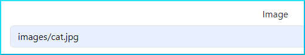
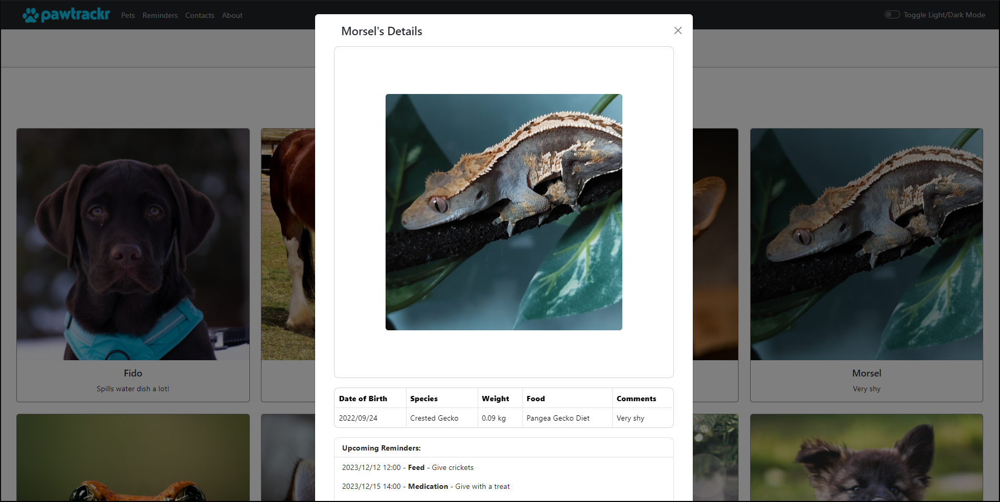
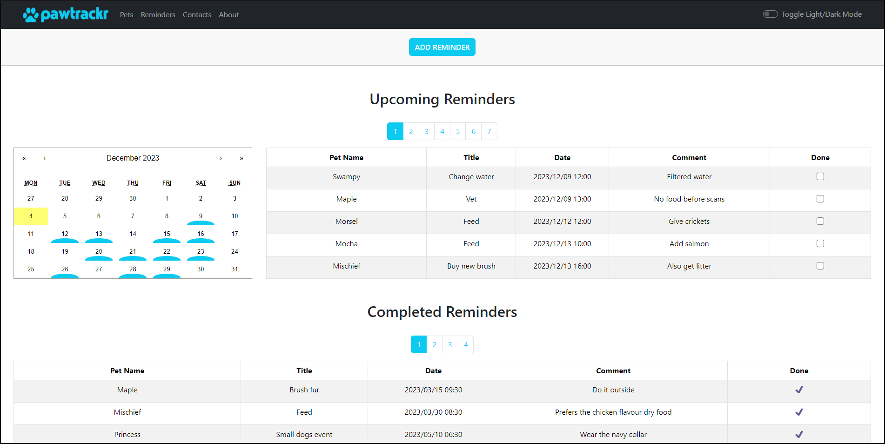
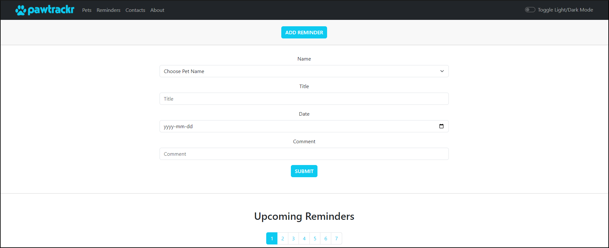
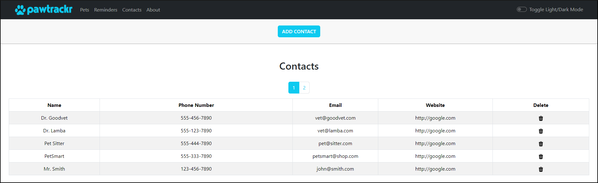
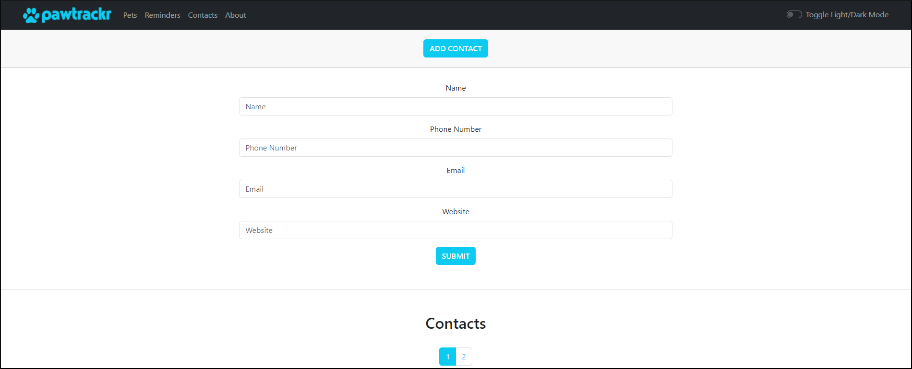

  
   
    Your <strong><em>complete</strong></em> Pet Care Solution

<h1 align="center">Meet the Team</h1>

<!-- Meet the Team -->

<kbd>

## devvaru
**FULL STACK SOFTWARE DEVELOPER**
  

  

  

</kbd>

 

<kbd>

## shivangi0109
**FULL STACK SOFTWARE DEVELOPER**
  

  

  

</kbd>

 

<kbd>

## kazvee
**FULL STACK SOFTWARE DEVELOPER**
  

  

  

</kbd>

*** 

# ✨ [Live Demo - Desktop App](https://pawtrackr.netlify.app/) ✨

**Please note:** The app goes into "sleep" (idle) mode to conserve resources when inactive.\
If you're the first visitor in a while, the first launch may take a few extra seconds to load, but subsequent launches will be much quicker! ⚡

**Add a Pet:** Feel free to copy & paste one of the lines below into the `image` field of the new pet form, to have the newly-added pet display with a photo! 🖼️  
`images/bunny.jpg`  
`images/chihuahua.jpg`  
`images/finch.jpg`  
`images/hamster.jpg`  
`images/betta-fish.jpg`  
`images/angora.jpg`  
`images/cat.jpg`  
`images/chocolate_lab.jpg`  
`images/collie.jpg`  
`images/dachshund.jpg`  
`images/dog.jpg`  
`images/frog.jpg`  
`images/parakeet.jpg`  
`images/shepherd.jpg`  
`images/shire_horse.jpg`  
`images/tabby_cat.jpg`  
`images/tortoise.jpg`  

**Example:**  

# Final Product - PawTrackr

**PawTrackr** is a full stack app that enables pet owners to track all their pets' info in a central place   
😼 Has your cat ever lied to you about if they've been fed yet or not?  
🐶 How does everybody in the house know if the dog’s been walked yet?  
🤔 Even with a trusted pet sitter, do you worry about your pets getting their medication on time when you’re out of town?  
🤩 We've built you the solution!

🐾 Welcome to **PawTrackr**

### Demo Video

https://github.com/Devvaru/PawTrackr/assets/109990289/a58bf60b-847f-4d87-ba97-7bc04ee0e25e

### Homepage View - All Pets:  

### Pet Modal View:

### Reminders View:

### Add New Reminder View:

### Contacts View:

### Add New Contact View:

### Screen Reader Video (🔊 turn sound on!)

https://github.com/Devvaru/PawTrackr/assets/109990289/381f46fb-bacd-49bd-9b10-97f40962a196

## [Project Planning Board](https://github.com/users/Devvaru/projects/1) 

## Project ERD (Entity Relationship Diagram)

<!-- A link to the ERD with dynamic highlighting of table relationships is available [HERE](https://dbdocs.io/**TBC**/**Filename-TBC**?view=relationships) -->

## Purpose

This project was created, designed, and built by:
* [devvaru](https://github.com/Devvaru)
* [shivangi0109](https://github.com/shivangi0109)
* [kazvee](https://github.com/kazvee)

for our Final Project at [Lighthouse Labs](https://www.lighthouselabs.ca/en/web-development-flex-program)

### Project Goals

While working to build this project to successful completion, we:

* Built an application from start to finish using a tech stack of our choosing
* Designed and architected a complete application
* Leveraged all of the skills and knowledge learned to date
* Created functional requirements, user stories, ERD, and wireframes
* Deployed the application to the cloud as a Stretch Goal Achievement 

### Project Outcomes & Learning Achievements

* Worked efficiently as a team
* Leveraged code sharing and carried out code reviews
* Collaborated effectively to deliver a product by the deadline
* Built a complete Project to add to our portfolio
* Rapidly acquired and applied new skills to enhance our final product:
  - React-Bootstrap, React-Calendar, Pagination, Light/Dark Theme changing, and Drag & Drop functionality 

## Accessibility (a11y)

Inclusive design is an ongoing process that belongs at the heart of software creation. We are eager to keep learning and growing our ability to build accessible digital solutions.  
Here are some resources and techniques that have helped us so far:
- [Google Lighthouse Accessibility Report](https://developer.chrome.com/docs/lighthouse/accessibility/scoring): contains an accessibility score and provides actionable feedback on issues detected
- [axe DevTools browser extension](https://chromewebstore.google.com/detail/axe-devtools-web-accessib/lhdoppojpmngadmnindnejefpokejbdd?hl=en-US&utm_source=chromedev): provides an automated accessibility audit and details on how to resolve problems
- [Manual Testing - Keyboard Checks](https://web.dev/learn/accessibility/test-manual#keyboard_checks): setting aside the mouse, we navigated our own app using only a keyboard
- [NVDA Screen Reader](https://www.nvaccess.org/): we used a screenreader on our own app, to ensure that navigation waypoints were detected and read out loud

With gratitude to the creators of the above tools, and the Chrome for Developers team for their [A11ycasts](https://youtube.com/playlist?list=PLNYkxOF6rcICWx0C9LVWWVqvHlYJyqw7g&si=hecDEvcnI4IgJc25) series. 

## Ideas for Future Development

* Logins for various household members
* Reminder SMS/Email alerts
* Multiple pet photos
* Pet health history tracking (weight, immunization dates)
* Mobile-friendly views
* Improve accessible design functionality
* Unit, Component, and E2E testing

## Dependencies

* [React](https://react.dev/)
* [React-Bootstrap](https://react-bootstrap.netlify.app/)
* [React-Beautiful-DnD](https://www.npmjs.com/package/react-beautiful-dnd/)
* [React-Calendar](https://www.npmjs.com/package/react-calendar/)
* [Express](https://expressjs.com/)
* [Node.js](https://nodejs.org/)
* [Node-Postgres](https://node-postgres.com/)
* [Babel](https://babeljs.io/)
* [Body-Parser](https://www.npmjs.com/package/body-parser/)
* [Axios](https://www.npmjs.com/package/axios/)
* [Morgan](https://www.npmjs.com/package/morgan/)
* [Dotenv](https://www.npmjs.com/package/dotenv/)

### Deploy Details:
* [Netlify](https://www.netlify.com/)
* [Render](https://render.com/)
* [ElephantSQL](https://www.elephantsql.com/)

## A note about `create-react-app`

For larger-scale production-ready applications with enhanced customization, React's official documentation and best practices now recommend other ways to [Start a New React Project](https://react.dev/learn/start-a-new-react-project)

Since this was a project for educational purposes, it has been bootstrapped with [Create React App](https://github.com/facebook/create-react-app) which provided a straightforward way to get a functional React app up and running quickly.

## Installation

### Getting Started

* Fork this repository to your own GitHub account
* Clone your fork to your local device

### Set up Frontend & Backend

* From within the project root folder, install all dependencies with `npm i` (or `npm install`), in the `/frontend` and `/backend` folders

### Set Up Database

* In a terminal window, connect to your PostgreSQL environment using the `psql` command and your login credentials
  * In some environments, the `startpostgres` command may need to be run beforehand
* Create a new database using the `CREATE DATABASE pawtrackr;` command, where 'pawtrackr' is the name you want to call this new DB
* Connect to the new database with the `\c pawtrackr` command, where 'pawtrackr' is whichever name you chose for your new DB in the the previous step

### Set up DB Tables

* Within `psql`, set up database tables by running the migrations file with `\i backend/src/db/schema/create.sql`.
* To verify the tables have been created, run command `\dt` and you should see tables named: `users`, `pets`, `reminders`, and `contacts`.

### Add Data to Tables

* Within `psql`, run the seed file with `\i backend/src/db/schema/seeds.sql`.
* To confirm that your tables have been populated with data, run command `SELECT * FROM users;` (or any of the table names) and you should see some data displayed.
* You can now exit postgres by typing `\q` to return to your command line.

### Add Database Credentials to **dotenv** file (`.env`)

* Using the provided `.env.example` file as a template, create a new `.env` file in the same folder.
* Add your database name, username, and password.
* **Note:** If running the app locally, the `DB_HOST` would be `localhost`, and for PostgreSQL the `DB_PORT` will usually be `5432`.
* For security reasons, the `.env` file has been added to the `.gitignore` file, so these sensitive details will not accidentally be published to GitHub.
  
### Start the App

* Connect to the database server from the root folder by using the `psql` command and your database credentials
* Start the backend by running the `npm start` command from within the `/backend` folder. The API server will run on Port 8080
* Start the frontend side using the `npm start` command from within the `/frontend` folder. The client will run on Port 3000
* Navigate to [http://localhost:3000](http://localhost:3000) in your browser

## Acknowledgements & Thanks

Photos provided by [Pexels](https://www.pexels.com/)
